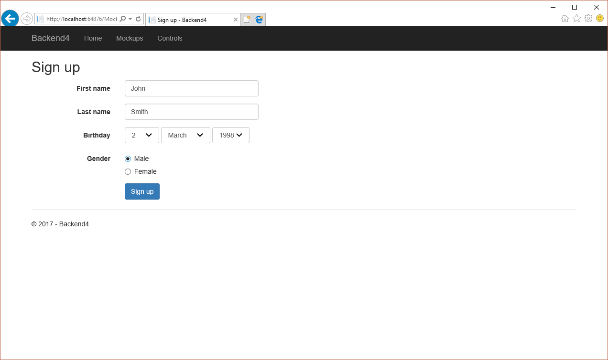
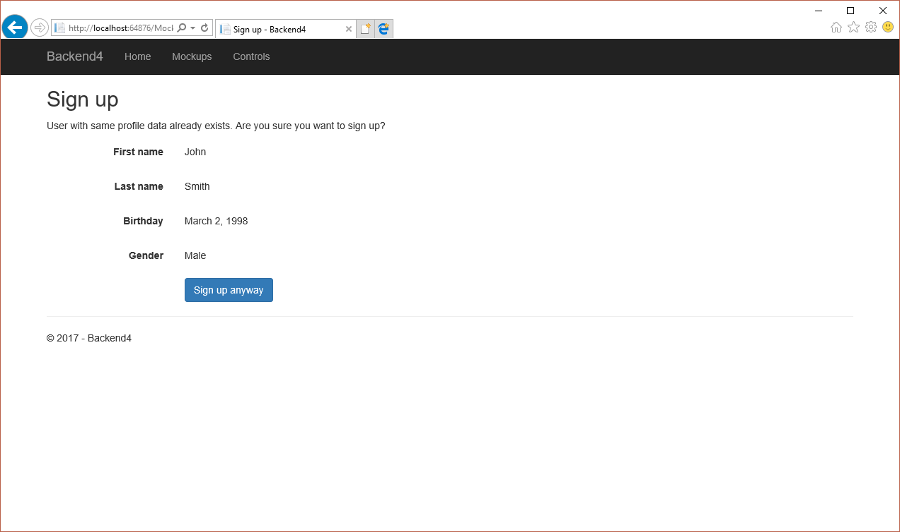
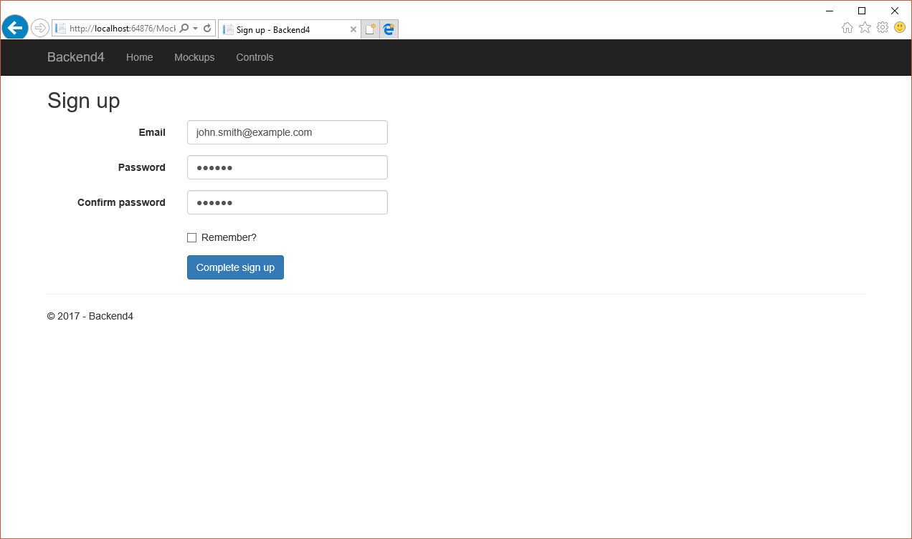
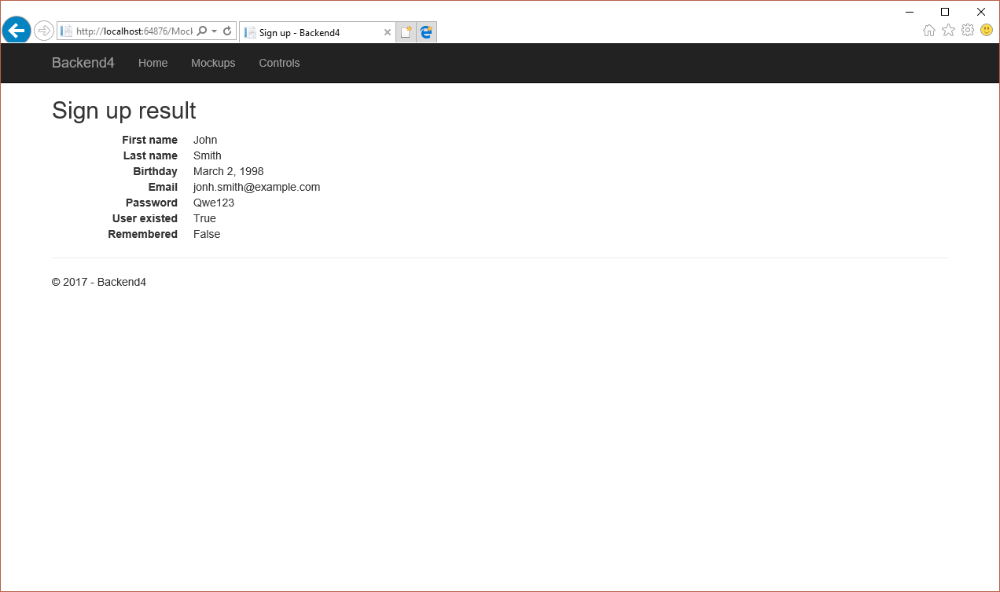

# Практика №4

## Темы

1. Построение форм, состоящих из нескольких шагов
2. Хранение данных в памяти процесса
3. Логгирование
4. Элементы форм

## Задачи

1. Ознакомиться с заготовленным проектом.
2. В заготовленном проекте:
   1. Определить, реализовать и зарегистрировать службу:
      * Служба регистрации пользователей - позволяет определить, есть ли пользователь с указанными данными (имя, дата рождения, пол) и регистрировать их.
        * Реализация службы должна быть Service Stub-ом - данные пользователей должны сохраняться в памяти процесса. 
        * В процессе работы служба должна логгировать совершаемые ей действия.
   2. Реализовать контроллер, который будет использовать эти службу для того, чтобы
      * Позволять пользователь пройти процедуру регистрации
      * Первоначально запрашивать у пользователя Имя, Фамилию, Дату рождения и Пол.
      * Проверять наличие такого пользователя в системе, и если он существует - запрашивать подтверждение продолжения
      * На последнем этапе - запрашивать почту и пароль
      * После завершения процедуры регистрации - отобразить отчет о результате регистрации
   3. Реализовать набор представлений для этого контроллера на основе макетов из ~/Views/Mockups.
   4. Из представления Home/Index сделать ссылки на действия нового контроллера.

## Результат









## Материалы

### Переход между этапами формы

В качестве результата сабмита формы может быть открыта другая форма, являющаяся продолжением первой и сохраняющая всю информацию, заполненную пользователем на первой форме. Таким образом можно организовать формы, состоящие из нескольких последовательных страниц, собирающих информацию от пользователя по частям, постепенно дополняя ранее собранную информацию. 

Модель представления таких форм удобно организовать путем наследования модели более поздних форм от более ранних:
```csharp
public class ResetViewModel
{
    [Required]
    [EmailAddress]
    public String Email { get; set; }
}

public class ResetCodeVerificationViewModel : ResetViewModel
{
    [Required]
    public String Code { get; set; }
}

public class ResetPasswordViewModel : ResetCodeVerificationViewModel
{
    [Required]
    [DataType(DataType.Password)]
    public String Password { get; set; }

    [Required]
    [DataType(DataType.Password)]
    [Compare("Password")]
    public String ConfirmPassword { get; set; }
}
```

Хранение данных предыдущих шагов можно организовать с помощью скрытых полей формы:
```html
<input asp-for="Email" type="hidden" />
<input asp-for="Code" type="hidden" />
<div class="form-group">
    <label asp-for="Password" class="col-md-2 control-label"></label>
    <div class="col-md-10">
        <input asp-for="Password" class="form-control" />
        <span asp-validation-for="Password"></span>
    </div>
</div>
<div class="form-group">
    <label asp-for="ConfirmPassword" class="col-md-2 control-label"></label>
    <div class="col-md-10">
        <input asp-for="ConfirmPassword" class="form-control" />
        <span asp-validation-for="ConfirmPassword"></span>
    </div>
</div>
```

Переход на следующую форму можно осущесвить путем явного рендеринга ее представления в качестве результата текущего шага:
```csharp
return this.View("CodeVerification", new ResetCodeVerificationViewModel
{
    Email = model.Email
});
```
При этом необходимо передать в новое представление корректную для него модель.


### Сохранение данных в службе

Для эмуляции постоянного хранения данных (без использования баз данных, файлов и других способов постоянного хранения) можно сохранять данные в службе-синглтоне. Поскольку служба-синглтон создается один раз и живет все время, пока запущен сайт, то эти данные также будут храниться все время работы сайта.

Пример:
```csharp
public sealed class PasswordResetService : IPasswordResetService
{
    private readonly List<Entry> codes = new List<Entry>();
}
```

В данном случае в службе заведена динамическая коллекция типа `List<Entry>` (`Entry` - класс описывающий модель данных, которую необходимо хранить), которая позволяет добавлять, удалять и искать элементы в ней.

Поскольку в веб-приложении запросы обрабатываются параллельно, а служба одна на все приложение, то необходимо обеспечить потокобезопасный доступ к ней. Для этого можно при каждой необходимости работы с непотокобезопасными членами класса службы (например тот же `List<T>` не является потокобезопасным) использовать блок `lock(obj) { }`, который гарантирует, что только один поток может находиться в один момент времени в блоке `lock`, связанным с объектом `obj`.

Пример:
```csharp
public void SendResetCode(String email)
{
    lock (this.codes)
    {
        var code = this.GenerateCode();
        this.codes.Add(new Entry(email, code));
        this.logger.LogInformation($"Sending reset code {code} to {email}");
    }
}
```

### Логгирование

Логгирование - механизм, позволяющий сохранять различную служебную информацию о работе приложения в журнал событий.

Получить службу, позволяющую логгировать события можно через внедрение зависимостей, запросив экземпляр службы типа `ILogger<T>`, где вместо `T` необходимо подставить тип (например класс или интерфейс), для которого предназначается данная служба:

```csharp
public class PasswordResetService : IPasswordResetService
{
    private readonly ILogger logger;
            
    public PasswordResetService(ILogger<IPasswordResetService> logger)
    {
        this.logger = logger;
    }
}
```

Для записи события необходимо использовать метод `Log` данной службы, либо один из методов-расширений, например `LogInformation`:

```csharp
this.logger.LogInformation($"Sending reset code {code} to {email}");
```

Например, в данном случае в журнал выводится сообщение о том, что произошла отправка указанного кода сброса пароля на указанный адрес e-mail.

Просмотреть журнал событий можно во время работы сайта в режиме отладки в Visual Studio в окне Output (источник - Debug).

Примечание: по умолчанию в приложении ASP.NET Core включена телеметрия ApplicationInsights, которая, в том числе, выводит достаточно много отладочной информации в журнал. Чтобы это отключить можно добавить следующую строчку в метод `Program.Main`, непосредственно перед `host.Run();`:
```csharp
TelemetryDebugWriter.IsTracingDisabled = true;
```


### Элементы управления формы

В контроллере `Controls` представлены примеры использования основных элементов управления форм вместе с моделью, которая может быть использована для model binding-а.